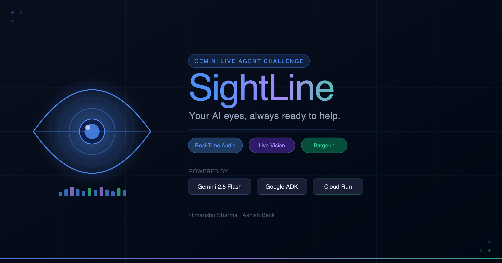
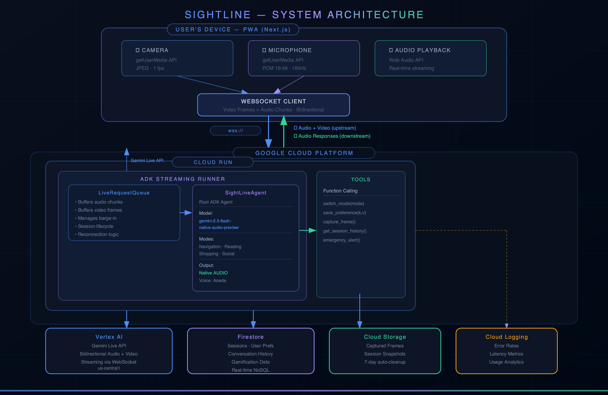

# I Built a Real-Time AI Vision Assistant for Blind Users Using Gemini Live API — Here's What I Learned


*SightLine — a real-time voice + vision AI assistant for the visually impaired, powered by Gemini Live API and Google ADK.*

*By [Himanshu Sharma](https://medium.com/@himanshusharma_4140) & [Ashish Beck](https://medium.com/@ashishbeck96) · #GeminiLiveAgentChallenge*

---

There are 285 million visually impaired people in the world.

The best tools available to them today are either expensive — Aira charges $99/month for a human agent — or turn-based: you snap a photo, wait, get a response. That's not how the world works. Life doesn't pause for a request/response cycle.

So we built **SightLine**: a real-time, voice-driven AI vision assistant that streams your camera and microphone to Gemini simultaneously, and talks back in natural audio — instantly, interruptibly, continuously.

No text box. No button to press. Just speak, and your phone becomes your eyes.

---

## Watch It in Action

[INSERT YOUTUBE EMBED HERE — paste your YouTube link and Medium will auto-embed it]

---

## The Problem No One Has Solved

When we looked at the landscape, the pattern was clear.

**Be My Eyes** connected blind users with sighted volunteers over video. Then they integrated GPT-4 Vision. But it's still turn-based — you take a photo, ask a question, wait. By the time the answer arrives, you've already walked into the shelf.

**Aira** gives you a trained human agent via video call. The experience is genuinely excellent, but at $99/month with limited availability, it's not for everyone.

**Seeing AI** from Microsoft offers a collection of single-purpose tools — read text, describe a scene, identify currency. But it's not a conversation. You can't ask a follow-up. You can't say "wait, what was that sign on the left?"

**OrCam MyEye** is hardware that clips to your glasses and reads aloud automatically. It costs $4,500. Most people in the world who need it can't access it.

The gap is obvious: **real-time, always-available, conversational vision AI**. Something that sees what you can't, responds the moment you speak, and works on the phone you already own.

That's what we set out to build.

---

## Why Gemini Live API Is Different

Most AI vision tools share the same pipeline:

> Speech → Speech-to-Text → Vision Model → Language Model → Text-to-Speech → Audio

Each handoff adds latency. Each handoff adds a potential failure point. The experience feels robotic because it is — you're talking to four separate systems stitched together.

Gemini's Live API (`gemini-2.5-flash-native-audio-preview`) eliminates the pipeline entirely.

It accepts a **continuous bidirectional stream** of audio and video simultaneously, and responds in **native audio** — sound generated directly by the model, not synthesized from text. The result is a single model that hears you, sees your camera, thinks, and speaks — all at once, with no handoffs.

For a blind user navigating a grocery store, the difference between 200ms and 2 seconds isn't just an inconvenience. It's the difference between useful and useless.

Three things make this genuinely new:

**Barge-in.** The user can interrupt the agent mid-sentence. Say anything and the agent stops immediately and responds. This is how humans talk to each other. No AI assistant has ever done this well before.

**Simultaneous modalities.** The model processes what you're saying and what it's seeing at the same time — not sequentially. It can answer "what does this sign say?" while also noticing the step you're about to walk into.

**Persistent context.** The model remembers what it saw three seconds ago, thirty seconds ago. You can ask "what was in that window we passed?" and it knows.

---

## How We Built It


*End-to-end architecture: the user's browser streams camera frames (JPEG, 1fps) and microphone audio (PCM 16kHz) over a WebSocket to Cloud Run, where Google ADK's LiveRequestQueue feeds everything into the Gemini Live API on Vertex AI — which responds in native audio streamed back in real time. Firestore stores sessions and preferences, Cloud Storage holds captured frames, and Cloud Logging tracks latency and errors.*

The architecture is three layers.

### The Frontend

A Next.js Progressive Web App. No app store — users open a browser, install it like an app, and it works on any device.

The browser captures the camera using the `getUserMedia` API at approximately one frame per second (more on why we chose 1fps later), compressed as JPEG. It simultaneously captures microphone audio as raw PCM at 16kHz — the format Gemini expects. Both streams travel over a single WebSocket connection to our backend.

When Gemini responds, the audio chunks stream back in real time and play through the Web Audio API with no buffering delay.

The UI has no text input field anywhere. Every interaction is voice and camera.

### The Backend

Python on Cloud Run, built with Google's Agent Development Kit (ADK).

ADK provides a primitive called `LiveRequestQueue` that handles the hardest parts of real-time bidirectional streaming: buffering audio/video frames, managing barge-in interruptions, and feeding everything to the Gemini Live API through Vertex AI.

```python
from google.adk.agents.live_request_queue import LiveRequestQueue

live_request_queue = LiveRequestQueue()

# Audio arrives from the browser WebSocket
await live_request_queue.send_realtime(
    types.Part(inline_data=types.Blob(
        mime_type="audio/pcm",
        data=audio_chunk
    ))
)

# Video frames arrive at ~1fps
await live_request_queue.send_realtime(
    types.Part(inline_data=types.Blob(
        mime_type="image/jpeg",
        data=frame_data
    ))
)
```

The agent itself is straightforward to define:

```python
root_agent = Agent(
    model="gemini-2.5-flash-native-audio-preview",
    name="SightLineAgent",
    instruction="""You are a real-time vision assistant for visually impaired users.
    Describe what you see clearly and concisely.
    Prioritize safety hazards above everything else.
    Never mention that you are an AI unless directly asked.""",
    tools=[switch_mode, save_preference, capture_frame, emergency_alert],
    generate_content_config=types.GenerateContentConfig(
        response_modalities=["AUDIO"],
        speech_config=types.SpeechConfig(
            voice_config=types.VoiceConfig(
                prebuilt_voice_config=types.PrebuiltVoiceConfig(
                    voice_name="Aoede"
                )
            )
        ),
    ),
)
```

### Four Modes, One Agent

SightLine has four specialized modes:

**Navigation** — scene description, obstacle warnings, reading signs and hazards. The system prompt prioritizes spatial information and safety above everything else.

**Reading** — OCR on documents, medicine labels, menus, price tags. The prompt instructs the model to read text verbatim rather than summarizing.

**Shopping** — product identification, price comparison, nutritional information. The prompt focuses on specific product details.

**Social** — describes people's expressions, body language, and actions. Privacy-conscious by design: the model is explicitly instructed never to identify individuals by name.

We initially considered building four separate agents and routing between them. That was overengineering. One agent with four system prompt variants, switched via a function call, is cleaner and faster. The user says "switch to reading mode" — the agent calls `switch_mode("reading")` and instantly adapts. No stream interruption. No restart.

### Function Calling Tools

The model can invoke four tools during a live session:

- `switch_mode(mode)` — switches the active mode and updates the system prompt
- `save_preference(key, value)` — persists user preferences to Firestore
- `capture_frame()` — saves the current camera frame to Cloud Storage
- `emergency_alert()` — triggers an emergency notification

What's remarkable is that these tool calls happen mid-stream without breaking the audio. The model hears "save this location," calls the tool server-side, and continues the conversation without the user noticing anything happened in the background.

---

## The Hard Problems

### Echo and Barge-In

Getting true barge-in right is non-trivial.

The phone speaker plays the agent's audio response. The phone microphone picks it up. The model hears its own voice and gets confused.

The fix is two-part. First, enable echo cancellation in the browser:

```javascript
const stream = await navigator.mediaDevices.getUserMedia({
  audio: {
    echoCancellation: true,
    noiseSuppression: true,
    sampleRate: 16000,
  }
});
```

Second, on the backend, suppress the microphone stream while the model is actively generating audio, and resume it the moment the user speaks. This creates clean barge-in: the user says anything, the agent stops mid-sentence, and listens.

### Frame Quality for Text Reading

When users hold their camera up to a medicine bottle or a restaurant menu, blurry frames produce hallucinated OCR — the model confidently reads text that isn't there.

The solution is in the system prompt: *"If the image is unclear or blurry, ask the user to hold the camera closer rather than attempting to read."* Simple, but it transformed the reliability of reading mode.

### Cloud Run Cold Starts

Cloud Run scales to zero when idle. For most web apps this is fine. For a live audio streaming app, a 3-second cold start when a user opens the session is catastrophic — they hear silence and assume it's broken.

Setting `min-instances=1` keeps one container warm at all times. It costs roughly $15/month. For a real-time audio product, it's not optional.

---

## What Surprised Us

**1fps is enough.**

We started with 5 frames per second, thinking we needed high frequency for meaningful scene understanding. We didn't. The model has audio context — it hears what the user is saying, and it's smart enough to understand the scene from one frame per second. Dropping to 1fps cut WebSocket bandwidth by 80% with no noticeable quality loss.

**Native audio sounds different.**

We expected Gemini's audio output to feel like text-to-speech. It doesn't. The prosody, pacing, and emphasis are contextually appropriate in a way that synthesized speech never achieves. When the agent says "careful, there's a step right in front of you" — the urgency is audible. For an accessibility product, this is not a minor detail.

**ADK function calling in streaming mode just works.**

We were prepared to build complex state management to handle tool calls within a live audio session. We didn't need to. ADK handles tool calls transparently within the stream. The model calls a function, the backend executes it, the model continues — all without any visible interruption.

---

## The Stack

- **AI Model:** Gemini 2.5 Flash Native Audio Preview via Vertex AI
- **Agent Framework:** Google ADK (Python) + LiveRequestQueue
- **Backend:** Python / FastAPI on Cloud Run
- **Frontend:** Next.js 15 PWA
- **Database:** Cloud Firestore (sessions, preferences, conversation history)
- **Storage:** Cloud Storage (captured frames, 7-day auto-cleanup)
- **Deployment:** `deploy.sh` — one command handles API enablement, bucket creation, CORS, and Cloud Run deploy

---

## What's Next

The immediate opportunity is smart glasses. The same WebSocket and ADK architecture works identically whether the camera feed comes from a phone browser or a glasses-mounted camera connected via a companion app. The Meta Ray-Ban form factor is the natural hardware target — always-on, hands-free, no screen required.

On the business side, the path is clearer than most AI products. Assistive technology has existing insurance reimbursement codes in the United States. Healthcare and enterprise accessibility are B2B channels that don't depend on consumer marketing. A freemium tier with usage limits handles individual users.

The $4 billion assistive technology market is growing at over 10% annually. The competitive moat is real-time streaming — it's technically difficult and takes time to replicate.

---

## Try It

The full source code is open on GitHub. The backend is one `pip install` and one `gcloud run deploy` away.

**Himanshu Sharma** — [GitHub](https://github.com/himanshu64) · [Medium](https://medium.com/@himanshusharma_4140) · [X](https://x.com/himansh68) · [LinkedIn](https://www.linkedin.com/in/himanshu-sharma-0666a5129/)

**Ashish Beck** — [GitHub](https://github.com/ashishbeck96) · [Medium](https://medium.com/@ashishbeck96) · [X](https://x.com/ashish_asdf) · [LinkedIn](https://www.linkedin.com/in/ashish-beck/) · [GDG](https://gdg.community.dev/u/m692mf/#/about)

---

*Built for the Gemini Live Agent Challenge · March 2026*

*Tags: #GeminiLiveAgentChallenge #AI #Accessibility #GoogleCloud #Python #MachineLearning #WebDev*

---

## If This Was Useful

If you found this article helpful, here's what you can do:

👏 **Clap** — hit the clap button (up to 50 times!) to help others find this article

💬 **Comment** — we'd love to hear your thoughts. Are you building something similar? Have questions about the ADK or Gemini Live API? Drop a comment below.

🔗 **Share** — share this with someone building AI accessibility tools, or anyone curious about what Gemini's Live API can do beyond the chat box.

📬 **Follow** — stay updated on what we build next:
- [Himanshu Sharma on Medium](https://medium.com/@himanshusharma_4140)
- [Ashish Beck on Medium](https://medium.com/@ashishbeck96)

⭐ **Star the repo** — [github.com/himanshu64/Gemini-live-agent](https://github.com/himanshu64/Gemini-live-agent)
