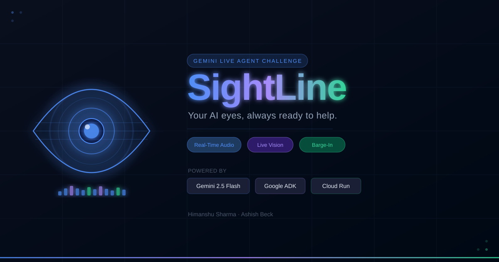
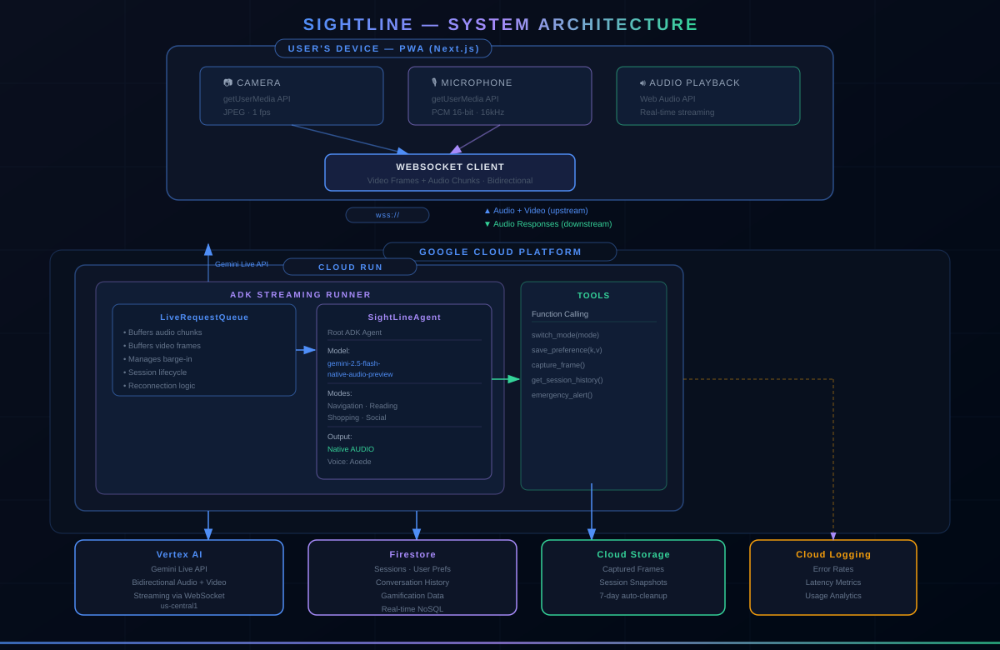

<p align="center">
  
</p>

# SightLine

> Your AI eyes, always ready to help.

A real-time AI vision assistant for the visually impaired, built with the **Gemini Live API** and **Google ADK**. SightLine lets users speak naturally and get instant audio responses about their surroundings — no typing, no waiting.

Built for the [Gemini Live Agent Challenge](https://devpost.com) · #GeminiLiveAgentChallenge

---

## Demo

[](https://youtu.be/VIDEO_ID)

> Replace `VIDEO_ID` with your YouTube video ID.

---

## What It Does

- **Navigation** — scene description, obstacle warnings, sign reading
- **Reading** — OCR on documents, labels, menus, medicine bottles
- **Shopping** — product identification, price reading
- **Social** — describe people's expressions and actions (privacy-conscious)

All modes are voice-driven with bidirectional streaming and barge-in support.

---

## Tech Stack

| Layer | Technology |
|-------|-----------|
| AI Model | `gemini-2.5-flash-native-audio-preview` via Vertex AI |
| Agent Framework | Google ADK + `LiveRequestQueue` |
| Backend | Python on Cloud Run |
| Frontend | Next.js PWA |
| Database | Firestore |
| Storage | Cloud Storage |

---

## Getting Started

### Prerequisites

- Python 3.11+
- Node.js 18+
- Google Cloud project with Vertex AI, Firestore, Cloud Run, Cloud Storage enabled

### Backend

```bash
cd backend
pip install -r requirements.txt
cp .env.example .env  # fill in GCP project, region
python main.py
```

### Frontend

```bash
cd frontend
npm install
cp .env.local.example .env.local  # fill in backend WebSocket URL
npm run dev
```

Open [http://localhost:3000](http://localhost:3000).

### Deploy to Cloud Run

```bash
./deploy.sh
```

---

## Architecture

<p align="center">
  
</p>

---

## License

MIT License

Copyright (c) 2026

Permission is hereby granted, free of charge, to any person obtaining a copy of this software and associated documentation files (the "Software"), to deal in the Software without restriction, including without limitation the rights to use, copy, modify, merge, publish, distribute, sublicense, and/or sell copies of the Software, and to permit persons to whom the Software is furnished to do so, subject to the following conditions:

The above copyright notice and this permission notice shall be included in all copies or substantial portions of the Software.

THE SOFTWARE IS PROVIDED "AS IS", WITHOUT WARRANTY OF ANY KIND, EXPRESS OR IMPLIED, INCLUDING BUT NOT LIMITED TO THE WARRANTIES OF MERCHANTABILITY, FITNESS FOR A PARTICULAR PURPOSE AND NONINFRINGEMENT. IN NO EVENT SHALL THE AUTHORS OR COPYRIGHT HOLDERS BE LIABLE FOR ANY CLAIM, DAMAGES OR OTHER LIABILITY, WHETHER IN AN ACTION OF CONTRACT, TORT OR OTHERWISE, ARISING FROM, OUT OF OR IN CONNECTION WITH THE SOFTWARE OR THE USE OR OTHER DEALINGS IN THE SOFTWARE.

## Authors

- **Himanshu Sharma** — [github.com/himanshu64](https://github.com/himanshu64)
- **Ashish Beck** — [github.com/ashishbeck96](https://github.com/ashishbeck96)

---

*Submitted to the Gemini Live Agent Challenge · March 2026*
